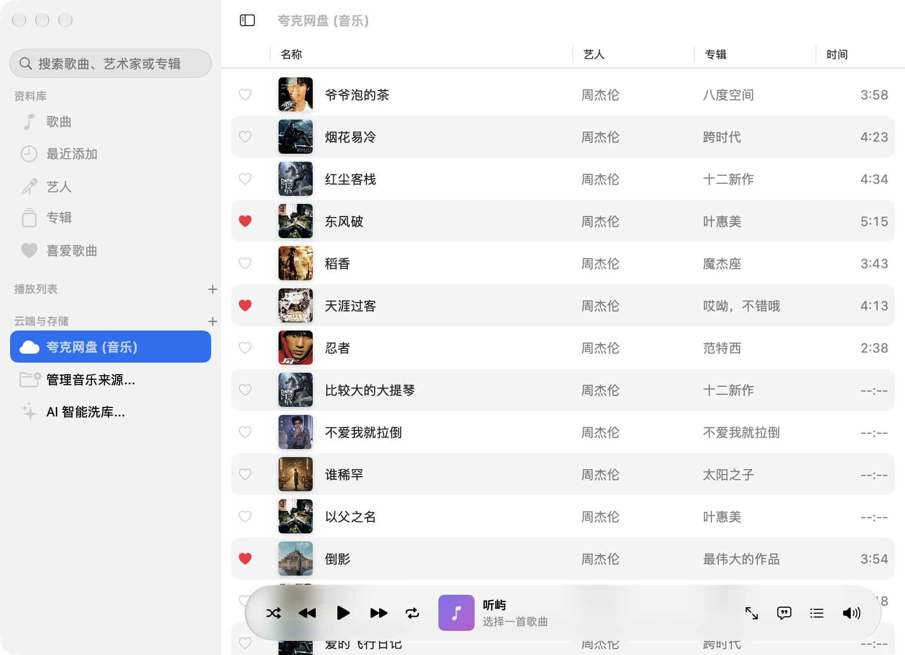

# 听屿 (TINGYU)

> **连接本地文件夹、WebDAV 私人云与夸克网盘的 100% 纯原生 Apple 音乐播放器。**  
> 深度还原官方 **Apple Music** 优雅设计与交互质感，专为 **macOS 15+ (Sequoia)** 与 **iOS 18+** 打造，采用 Swift 6、SwiftUI、SwiftData、AVFoundation、AppIntents 与 WidgetKit 深度构建。

> [!NOTE]
> **平台验证状态说明**：本项目目前主要在 **macOS 15+ (Sequoia)** 环境上完成了全功能的深度实机验证与持续打磨。代码仓库中已完整包含 **iOS 18+** 的全套原生界面与组件支持，但因作者目前手头暂无可用 iOS 实机测试设备，真机实测仍在推进中，十分欢迎拥有 iOS 设备的开发者与朋友一同体验与反馈！
<p align="center">
  
  
  
  
  
</p>

---

## 界面预览 (Screenshots)

### 🎵 曲库主界面与精细化悬浮播放栏
紧凑的原生窗口布局，Apple Music 标志性红粉色主题 (`#FA243C`)，支持行悬浮单击开播、动态音波指示、右键直通专辑/艺人，以及底部「待播清单 (Up Next)」浮层：

<p align="center">
  
</p>

### 🌌 1:1 原生级全屏沉浸流体播放器与动态歌词
自适应封面色谱的流体渐变动态背景、毫秒级逐字时间轴滚动歌词、超细进度条与一键收藏：

<p align="center">
  
</p>

---

## 特性亮点

### 1. 深度对齐官方 Apple Music 原生体验
- **官方设计语言**：注入 Apple Music 标志性红粉强调色 (`#FA243C`)，全系遵循 Liquid Glass 现代同心圆角、半透明磨砂材质与自然弹性物理动效。
- **纯正侧边栏体系**：
  - **资料库**：`歌曲`、`最近添加`、`艺人`、`专辑`、`喜爱歌曲`；
  - **播放列表**：自建歌单创建、编辑与快捷点播；
  - **云端与存储**：收纳已挂载网盘、`管理音乐来源...` 与 `AI 智能洗库...`，保持窗口顶栏纯净清爽。
- **全新大画幅「专辑主页（AlbumDetailView）」**：
  - 大尺寸封面 Header、红色歌手超链接跳转、流派/年份/首数/总时长统计。
  - 大号红色「播放」与「随机播放」主按钮，精致排版的音轨列表。
  - 专辑网格卡片支持鼠标悬浮一键开播全专。
- **全新「艺人主页（ArtistDetailView）」**：
  - 顶部艺人巨幅大圆肖像、歌手统计、「热门歌曲」Top 5 精选，以及该艺人全作品专辑横滑陈列墙。
  - **歌手真实写真刮削（`ArtistAvatarStore`）**：告别以唱片封面充当歌手头像，自动联网抓取歌手超清肖像并持久化缓存在本地磁盘，支持离线秒开。
- **歌曲列表极致交互（`MacOSTrackTable`）**：
  - 鼠标悬浮行即刻浮现播放三角，单击即刻开播；当前曲目呈现动态小喇叭音波。
  - 右键菜单支持「在专辑中查看」、「在艺人中查看」、「下一首播放」、「加入播放列表」。
  - 列表向下滑动充裕避让底栏（110pt），滑动条严格约束在圆角以内。
- **底栏播放控制器与「待播清单（Up Next Queue）」**：
  - 进度条与高亮全面对齐 Apple Music 红色，时间显示精准。
  - 新增 `list.bullet` 待播清单浮层，实时查看当前播放及后续待播歌曲，支持点击插播与一键清空。
- **全屏沉浸流体播放器**：
  - 动态模糊渐变背景，封面下方集成时间、超细进度条、爱心喜欢、播放控制与歌词气泡开关。
  - 支持键盘 `Esc` 键与 `⌘ ⇧ F` 秒级出入，原生红黄绿三色控制灯无缝融合。

### 2. 多云端与本地存储原生直连
- **本地文件夹**：采用 macOS / iOS 原生安全书签（Security-Scoped Bookmarks），持久化保留音乐目录读取授权，安全无干扰。
- **WebDAV 私人云**：支持群晖、坚果云、Nextcloud 等标准 WebDAV 服务器，RFC 4918 目录解析，温和流控调度。
- **夸克网盘 (Quark Drive) 原生直连**：内嵌官方 WebKit 安全登录网关，手机扫码秒级授权，两步式目录挑选，动态换取 CDN 签名 Range 直链边下边播。

### 3. 多源智能音乐刮削管线
- **智能文件名噪音清洗 (`SmartTitleParser`)**：智能识别华语音乐 `歌手 - 歌名` 格式，自动剥离音轨号、前导点、`[HQ]`、`(Live)` 等噪音；
- **QQ 音乐官方正版源 (`QQMusicScraper`)**：周杰伦及华语流行歌曲 100% 正版专辑与 800x800 原生超清封面精准匹配；
- **权威同步歌词 (`LRCLIBScraper`)**：毫秒级精准 LRC 时间轴滚动歌词；
- **单曲右键重新匹配**：在曲目列表右键点击即可弹出可视化多候选匹配卡片，用户可自主挑选最契合的版本一键应用。

### 4. AI 大模型智能识别与洗库
- 兼容标准 OpenAI 协议（`/chat/completions`）；
- 预设一键切换 **DeepSeek**（调用成本极低）、**通义千问 (Qwen)**、**Kimi**、**OpenAI**、**本地 Ollama**；
- 提供一键「AI 深度洗库」流水线，将各种乱码或特殊命名文件批量秒级还原为标准歌名、歌手与专辑。

### 5. Apple 系统级生态深度打通
- **系统媒体中心**：`MPNowPlayingInfoCenter` 与 `MPRemoteCommandCenter`，打通锁屏媒体卡片、控制中心、触控栏与 AirPods 耳机手势；
- **菜单栏常驻控制器 (`MacOSMenuBarExtra`)**：顶部状态栏一键弹窗，支持封面预览、进度条、爱心收藏与切歌控制；
- **Siri 快捷指令与 App Intents**：原生注入“在听屿中播放”、“听屿切歌”等语音动作；
- **桌面与锁屏小组件 (`WidgetKit`)**：提供小号、中号及锁屏胶囊小组件，支持直接点击交互切歌；
- **iCloud (CloudKit) 多端云同步**：SwiftData 私有数据库跨端自动同步，离线自适应降级。

---

## 工程结构

```text
.
├── project.yml                       # XcodeGen 声明式工程配置
├── Tingyu.xcodeproj                 # Xcode 项目工程
├── Sources/
│   ├── App/
│   │   └── TingyuApp.swift           # App 入口、全局 Apple Music 红色主题、WindowGroup 与 MenuBarExtra
│   ├── Models/
│   │   ├── Track.swift               # SwiftData 曲目持久化实体
│   │   ├── MusicSource.swift         # 音乐来源实体 (本地文件夹 / WebDAV / 夸克网盘)
│   │   ├── Playlist.swift            # 播放列表实体
│   │   └── LyricLine.swift           # 时间轴 LRC 歌词解析引擎
│   ├── Services/
│   │   ├── Audio/
│   │   │   ├── AudioPlayerService.swift # AVPlayer 低能耗播放引擎、循环模式与队列
│   │   │   ├── NowPlayingManager.swift  # MPNowPlayingInfo & MPRemoteCommands 系统控制
│   │   │   └── SharedPlaybackState.swift # 跨进程 WidgetKit 共享播放状态
│   │   ├── Security/
│   │   │   └── KeychainService.swift    # Apple Keychain 原生凭据存储（支持沙盒与本地双重容错）
│   │   ├── Library/
│   │   │   ├── LocalLibraryScanner.swift # 安全书签与 AVAsset 本地递归扫描
│   │   │   └── LegacyCacheMigrator.swift # 历史缓存自动迁移救援
│   │   ├── WebDAV/
│   │   │   ├── WebDAVClient.swift       # WebDAV async/await 网络客户端
│   │   │   └── WebDAVXMLParser.swift    # WebDAV PROPFIND XML 深度解析器
│   │   ├── Quark/
│   │   │   ├── QuarkDriveClient.swift   # 夸克网盘 API 驱动与 CDN 直链解析
│   │   │   └── QuarkCookieStore.swift   # 夸克持久化凭据管理与磁盘兜底
│   │   ├── Scraper/
│   │   │   ├── ArtistAvatarStore.swift  # 歌手真实写真肖像抓取与磁盘缓存
│   │   │   ├── QQMusicScraper.swift     # QQ 音乐正版专辑与超清封面抓取
│   │   │   ├── LRCLIBScraper.swift      # LRCLIB 歌词检索服务
│   │   │   ├── NetEaseScraper.swift     # 网易云公开数据源与歌手写真
│   │   │   ├── iTunesCoverScraper.swift # iTunes Search 国际封面兜底
│   │   │   ├── SmartTitleParser.swift   # 智能文件名清洗与复合结构提取
│   │   │   ├── ChineseConverter.swift   # 原生繁简中文转换
│   │   │   └── MetadataEnricher.swift   # 多源降级并发调度器
│   │   ├── Cloud/
│   │   │   └── CloudSyncManager.swift   # CloudKit iCloud 多端同步管理器
│   │   └── Intents/
│   │       └── TingyuIntents.swift      # App Intents & Siri Shortcuts 快捷指令
│   ├── UI/
│   │   ├── Shared/
│   │   │   ├── CoverArtView.swift       # 封面图片展示与占位
│   │   │   ├── ArtistAvatarView.swift   # 歌手真实写真圆形头像组件
│   │   │   ├── AlbumDetailView.swift    # 官方 Apple Music 风格大画幅专辑主页
│   │   │   ├── ArtistDetailView.swift   # 官方 Apple Music 风格艺人详情主页
│   │   │   ├── UpNextQueueView.swift    # 待播清单 (Up Next) 弹出面板
│   │   │   ├── AlbumGridView.swift      # 专辑封面网格与悬浮开播
│   │   │   ├── ArtistListView.swift     # 艺人列表与真容头像聚合
│   │   │   ├── FluidBackgroundView.swift# 动态流体磨砂玻璃渐变背景
│   │   │   ├── AnimatedLyricsView.swift # Apple Music 级动态时间轴歌词
│   │   │   ├── PlaybackControls.swift   # 进度条与播放控制组件
│   │   │   ├── TrackRowView.swift       # 曲目行与上下文菜单
│   │   │   ├── SourceManagerView.swift  # 本地、WebDAV 与夸克来源管理器
│   │   │   ├── AddQuarkSheet.swift      # 夸克网盘扫码与目录选择面板
│   │   │   ├── AISettingsView.swift     # AI 大模型智能识别与洗库设置
│   │   │   └── ManualMatchSheet.swift   # 单曲右键重新匹配元数据弹窗
│   │   ├── macOS/
│   │   │   ├── MacOSContentView.swift   # macOS NavigationSplitView 主界面与顶层导航
│   │   │   ├── MacOSTrackTable.swift    # 歌曲列表表格（悬浮播放、波形、爱心列、右键直达）
│   │   │   ├── MacOSNowPlayingToolbar.swift # 悬浮磨砂玻璃底栏与 1:1 全屏流体播放器
│   │   │   └── MacOSMenuBarExtra.swift  # 顶部状态栏迷你控制器
│   │   ├── iOS/
│   │   │   ├── IOSContentView.swift     # iOS TabView 导航界面
│   │   │   ├── IOSMiniPlayer.swift      # 悬浮 MiniPlayer 胶囊
│   │   │   └── IOSNowPlayingSheet.swift # 全屏沉浸播放器与歌词面板
│   │   └── Widgets/
│   │       └── TingyuWidget.swift       # 桌面与锁屏交互小组件 (WidgetKit)
│   └── Resources/
│       ├── Assets.xcassets/          # 1024x1024 通用高清应用图标
│       ├── Tingyu-macOS.entitlements # macOS 沙盒与安全书签授权
│       ├── Tingyu-iOS.entitlements   # iOS CloudKit 授权
│       ├── Info-macOS.plist          # macOS 应用配置
│       └── Info-iOS.plist            # iOS 应用配置 (后台音频播放等)
├── docs/
│   └── screenshots/                  # 高清界面预览截图
└── dist/
    ├── Tingyu-macOS.dmg             # 发布版 macOS DMG 安装镜像
    └── Tingyu-macOS.zip             # 发布版 macOS 绿色压缩包
```

---

## 开发与构建

### 运行环境要求
- **macOS 15.0+**（当前主力深度实机验证平台）
- **iOS 18.0+**（代码与组件已齐备，实机测试推进中）
- Xcode 16.0+
- Command Line Tools (`xcode-select --install`)
- [XcodeGen](https://github.com/yonaskolb/XcodeGen) (`brew install xcodegen`)
### 快速开始

1. **生成或更新 Xcode 工程**：
   ```bash
   xcodegen generate
   ```

2. **使用 Xcode 打开工程**：
   ```bash
   open Tingyu.xcodeproj
   ```
   在 Xcode 顶部选择 `Tingyu-macOS` 或 `Tingyu-iOS` Target 即可直接运行或调试。

3. **命令行构建 macOS Release 产物**：
   ```bash
   xcodebuild -project Tingyu.xcodeproj \
              -scheme Tingyu-macOS \
              -destination 'platform=macOS' \
              build
   ```

---

## 开源协议与声明

- 本项目基于 [MIT License](LICENSE) 开源。
- **免责声明**：本项目定位为**个人私有云盘与本地音频播放工具**。应用自身不内置、不提供、不分发任何受版权保护的音乐音频资源，所有播放内容均来源于用户合法拥有的个人存储或第三方网盘授权。
