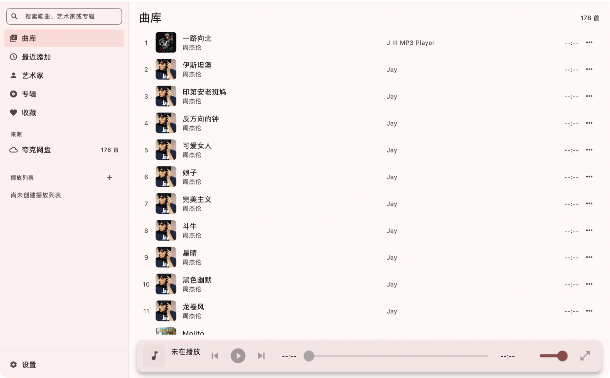
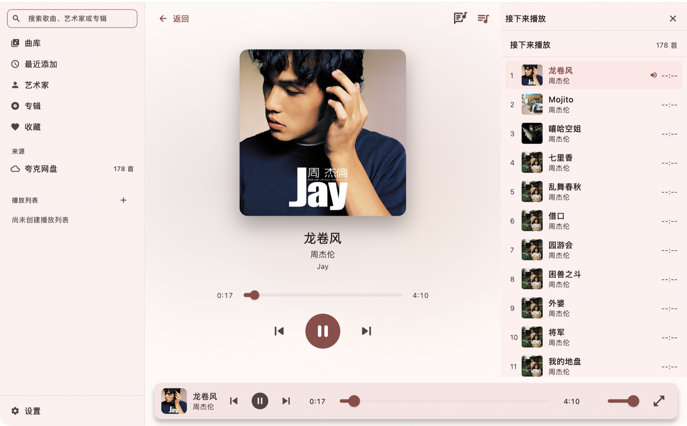
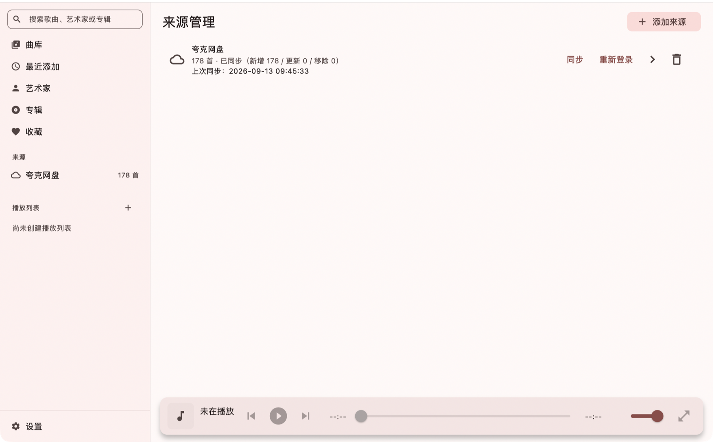

# 听屿 (TINGYU)

> **连接本地文件夹、WebDAV 私人云与夸克网盘的跨平台音乐播放器。**
> 一套 Dart / Flutter 代码覆盖 **macOS、Windows、Linux、Android、iOS**，界面沿袭 Apple Music 的红粉强调色、磨砂材质与流体播放舞台。

> [!NOTE]
> 现役实现是 **`app/`（Flutter）**；上一版 SwiftUI 实现整体归到 **`legacy-swift/`**（`Sources/`、`Tingyu.xcodeproj/`、`project.yml`），**冻结不再演进**，只作移植参考。
> 完整的移植方案、每一步的验证结论与遗留项都记在 **[`docs/crossplatform-migration.md`](docs/crossplatform-migration.md)**。

<p align="center">
  
  
  
  
  
</p>

---

## 界面预览

### 曲库主界面
侧栏（曲库 / 最近添加 / 艺术家 / 专辑 / 收藏 + 来源 + 播放列表）、带封面的曲目列表与底部悬浮播放条：

<p align="center">
  
</p>

### 全屏「正在播放」与待播清单
随封面取色的流体渐变舞台、超细进度条与传送器，右侧是实时待播队列：

<p align="center">
  
</p>

### 来源管理
夸克网盘 / WebDAV / 本地目录三类来源的同步状态、重新登录与添加入口：

<p align="center">
  
</p>

### 手机端
窄屏上来源改成一来源一卡片：标题、状态、操作分行摆放，删除收进右上角菜单（整张卡片可点进详情）：

<p align="center">
  
</p>

> `main-window.png` 与 `now-playing-fullscreen.png` 是上一版 SwiftUI 实现的截图，保留在同目录作对照。

---

## 特性亮点

### 1. 播放内核：桌面与移动各取所长
- **桌面**用 `media_kit`（libmpv）：统一解码、gapless、缓冲可控、任意 URL + 自定义请求头；**移动端**用 `just_audio`（ExoPlayer / AVPlayer）：功耗与系统集成更好。引擎由 `playback/engine_factory.dart` 按平台注入，界面只认 `PlaybackEngine` 接口。
- **系统媒体会话**由 `audio_service` 一套 `AudioHandler` 打通：Android MediaSession + 前台服务、iOS 锁屏与控制中心、macOS Now Playing、Windows SMTC（`audio_service_win`）、Linux MPRIS（`audio_service_mpris`）。
- 待播队列（列表内点击即插播）、时间轴歌词（自动滚动 + 当前行高亮 + 一键抓取）、迷你播放条与全屏「正在播放」舞台。
- 加载失败不再静默：失败写进播放快照并在界面提示（`PlaybackFailure`）。
- 循环/随机是真的下发给引擎的（`LoopMode.one` / `PlaylistMode.single`），不是只在界面上换图标；
  播完停止后再按播放键会从头重放，不会卡在"点了没反应"。
- 界面不会跟着进度条一起重画：进度 tick 只重建进度条本身（详见 §31.3）。

### 2. 三种音乐来源，原生直连
- **本地文件夹**：桌面直接读文件系统路径；**Android** 走 SAF 目录授权（持久化 tree URI，`content://` 直接交给 ExoPlayer）；**iOS** 走系统文档选择器 + 安全作用域书签。两端的原生桥都是仓库内的本地插件 **`app/packages/tingyu_saf`**。
- **WebDAV**：群晖 / 坚果云 / Nextcloud 等标准 WebDAV，PROPFIND 解析目录，带鉴权头取流。
- **夸克网盘**：应用内官方网页登录 / 手机端跳转夸克确认 / Cookie 导入，目录挑选后动态换取 CDN 直链播放。

### 3. 多源元数据刮削
- 文件名清洗（`SmartTitleParser`）识别 `歌手 - 歌名`，剥离音轨号、前导点、`[HQ]`、`(Live)` 等噪音；
- QQ 音乐 / 网易云 / iTunes / LRCLIB 多源降级抓取封面与歌词；繁简转换用内置 OpenCC 字表；封面与歌手写真落盘缓存；
- 单曲可「重新匹配」，在多候选中人工挑一个覆盖。

### 4. 数据与凭据
- 曲库落在 drift(SQLite)：`tracks` / `music_sources` / `playlists`；扫描按 `filePathOrUrl` 合并（整轮一个 batch），分别统计新增 / 更新 / 移除；只有完整扫描会移除未见曲目，取消、截断、跳过条目、目录层级超限、响应无法解析都会让本次扫描**不具权威性**，从而保留旧曲目及其收藏、歌单引用；
- 封面按内容哈希落盘（同一张专辑封面只存一份），完整同步后自动回收不再被引用的旧图；
- 时长从解码器回填：夸克/WebDAV 的目录接口不报时长，播过一次之后界面就是真实时长；
- 本地目录重复同步近似空转：大小与修改时间都没变的文件跳过标签解析与封面写盘；
- 夸克 Cookie、WebDAV 密码等凭据进系统安全存储（Keychain / DPAPI / libsecret）；
- 旧版曲库可用 `tools/legacy-export/` 一次性导出后导入。

### 5. 与上一版 SwiftUI 实现的差异
- **已对齐**：曲库 / 最近添加 / 收藏、专辑与艺术家浏览、播放列表、播放条与全屏舞台、歌词、队列、来源管理与同步、人工匹配、设置页、AI 智能识别与洗库（`AIService` / `AIMetadataParser` / `AISettingsPage`）。
- **尚未迁移**：macOS 原生三件套（WidgetKit 小组件、App Intents / Siri、AirPlay 路由选择器）——见 `docs/crossplatform-migration.md` §18 的 M6。

---

## 工程结构

```text
.
├─ app/                                        # 现役 Flutter 工作区
│  ├─ lib/
│  │  ├─ main.dart                             # 入口：装配、AudioHandler、调试入口
│  │  ├─ app/                                  # router · theme · providers · playback_controller · track_resolver · source_adapters
│  │  ├─ data/                                 # db/(schema + database + drift 生成) · models/ · repositories/
│  │  │                                        #   cover_store · secure_store · legacy_import · enrichment_service
│  │  ├─ sources/                              # local/(扫描器 · Android SAF · iOS 书签) · webdav/ · quark/ · scraper/
│  │  ├─ playback/                             # playback_engine · engine_factory · just_audio_engine · media_kit_engine
│  │  │                                        #   playback_item · playback_snapshot · tingyu_audio_handler
│  │  └─ features/                             # library · albums · artists · playlists · player · sources · settings · shell · shared
│  ├─ packages/tingyu_saf/                     # 本地插件：Android SAF + iOS 安全作用域书签
│  ├─ macos/ windows/ linux/ android/ ios/
│  ├─ assets/                                  # 应用图标 · OpenCC 字表
│  └─ test/                                    # flutter_test 测试（解析器 / 数据层 / 播放队列 / 来源）
├─ docs/
│  ├─ crossplatform-migration.md               # 迁移方案与逐阶段验证结论（含遗留项）
│  └─ screenshots/
├─ tools/legacy-export/                        # 旧版 SwiftUI 曲库的一次性导出工具
├─ legacy-swift/                               # 上一版 SwiftUI 实现：Sources/ · Tingyu.xcodeproj/ · project.yml，冻结保留
└─ .github/workflows/flutter.yml               # analyze + test（含 drift 生成代码校验）+ 四平台构建（macOS / Windows / Linux / Android，另含 iOS 编译校验）
```

---

## 开发与构建

### 环境
- **Flutter 3.47+**（开发机：3.47.2 / Dart 3.13.2）
- 按目标平台装工具链：
  - macOS / iOS：Xcode（iOS 走 CocoaPods，本地插件 `tingyu_saf` 以 Pod 形式集成）
  - Windows：Visual Studio 的「使用 C++ 的桌面开发」工作负载
  - Linux：`libmpv-dev libsecret-1-dev libayatana-appindicator3-dev ninja-build libgtk-3-dev pkg-config`
  - Android：Android SDK + JDK

### 常用命令
```bash
cd app

flutter pub get

# 跑起来（macOS / Windows / Linux / Android / iOS）
flutter run -d macos

flutter analyze
flutter test

# 打包
flutter build macos --release        # → build/macos/Build/Products/Release
flutter build windows --release
flutter build linux --release
flutter build appbundle --release    # Android
flutter build ios --release

# 改了 data/db/schema.dart 之后必须重新生成（CI 会校验生成代码是否同步）
dart run build_runner build
```

### Android 正式签名
正式分发用的密钥不进仓库。把密钥信息写到 `app/android/key.properties`（已在 `.gitignore` 中）：

```properties
storeFile=/absolute/path/to/tingyu-release.jks
storePassword=…
keyAlias=tingyu
keyPassword=…
```

有该文件时 `flutter build apk --release` 用正式密钥签名；没有时退回 debug 签名并打印一行提示
（产物仍可用于本机 `flutter run --release`，但不能分发）。

### 调试入口（`main.dart` 读取的环境变量）
| 变量 | 作用 |
|---|---|
| `TINGYU_DEBUG_ROUTE=/sources` | 启动即打开某个页面（截图 / 排查用） |
| `TINGYU_DEBUG_SCAN_DIR=<目录>` | 在真实进程里跑一次「扫描 → 合并入库」并打印结果 |
| `TINGYU_DEBUG_LEGACY_JSON=<文件>` | 导入旧版导出的曲库 JSON |
| `TINGYU_DEBUG_SOURCES=<a,b,...>` | 启动即载入队列并播放，便于脚本化验证播放链路 |

### CI
`.github/workflows/flutter.yml`：推到 `main` 或改动 `app/**` 的 PR 在 Ubuntu 上跑
`dart run build_runner build` 校验 drift 生成代码无漂移、`flutter analyze` 与 `flutter test`，
随后跑构建矩阵 —— macOS / Windows / Linux / Android 的 `--release` 产物，外加 iOS 的
`--no-codesign` 编译校验（未签名产物不进入 GitHub Release）；推 `v*` tag 时额外发 Release。

> 注意 `on.push` 必须同时写 `branches` 与 `tags`：只写 `tags` 会让分支推送**完全不触发**
> 这个 workflow（GitHub 的行为，已在 §31.8 记录踩坑经过）。

> 本机跑 `flutter analyze` 时，若仓库路径含非 ASCII 字符，analysis server 的 LSP 通道会解析崩溃；
> 用 `dart analyze` 得到同样的结论。

---

## 平台与验证状态

| 平台 | 状态 |
|---|---|
| **macOS 12+** | ✅ 主力验证平台：播放与系统媒体会话、曲库 / 专辑 / 艺术家 / 播放列表、全屏舞台与歌词、来源管理均已实机核验（本文截图即本机实拍） |
| **Android** | ✅ 真机（Xiaomi 24031PN0DC / Android 16）验证：播放与后台播放、SAF 本地音乐入库与播放、夸克应用内登录、**播放失败提示**（引擎侧与取直链侧都已核过，§23） |
| **iOS 15+** | ✅ 构建与模拟器运行验证通过；本地目录书签（安全作用域）已落地，真机端到端「选目录 → 入库 → 播放」待补（§24） |
| **Windows / Linux** | ⚠️ Linux 已在本机跑过 Release 包实机冒烟（曲库/专辑/来源页渲染、扫码入库、播放推进，见 §31.9）；Windows 仍只有 CI 构建验证 |

里程碑进度：**M0–M5 已完成**；M6（macOS 原生增强：WidgetKit / App Intents / AirPlay）与 M7（各平台分发与签名）未开始。
2026-09-26 做过一轮全面优化（数据丢失修复、播放正确性与重建风暴、封面去重 91%、索引迁移、来源重试、
移动端搜索入口、CI 补 iOS 与 Android 正式签名），结论与"明确未做"的清单见
[`docs/crossplatform-migration.md`](docs/crossplatform-migration.md) §31。

---

## 开源协议与声明

- 本项目基于 [MIT License](LICENSE) 开源。
- **免责声明**：本项目定位为**个人私有云盘与本地音频播放工具**。应用自身不内置、不提供、不分发任何受版权保护的音乐音频资源，所有播放内容均来源于用户合法拥有的个人存储或第三方网盘授权。
